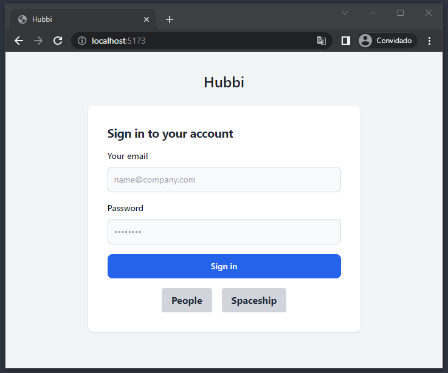
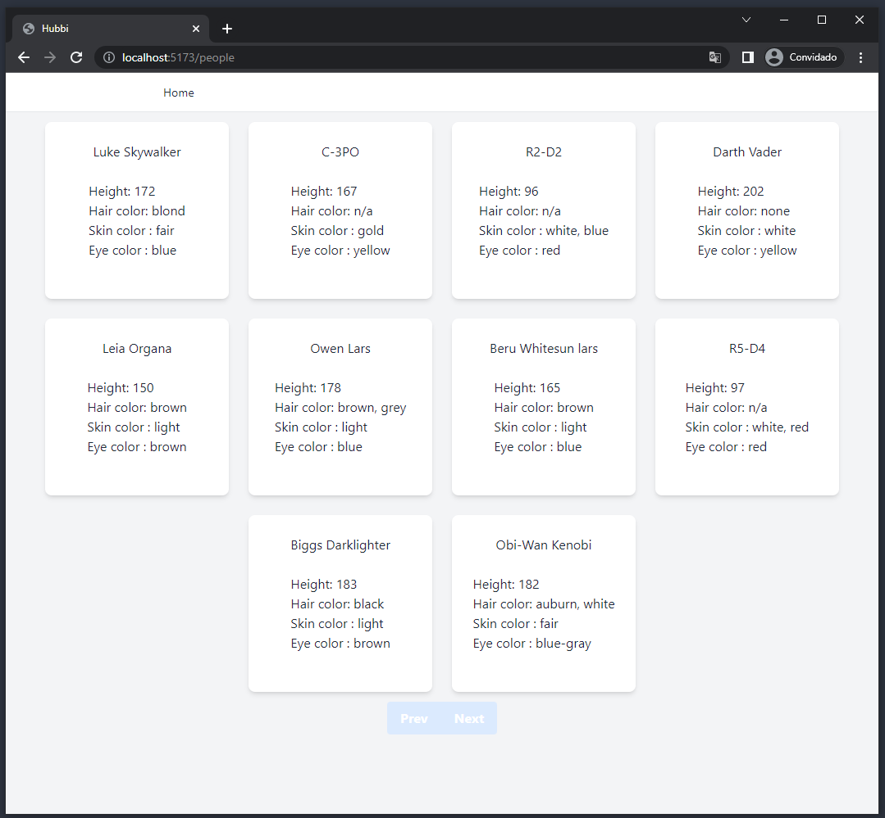
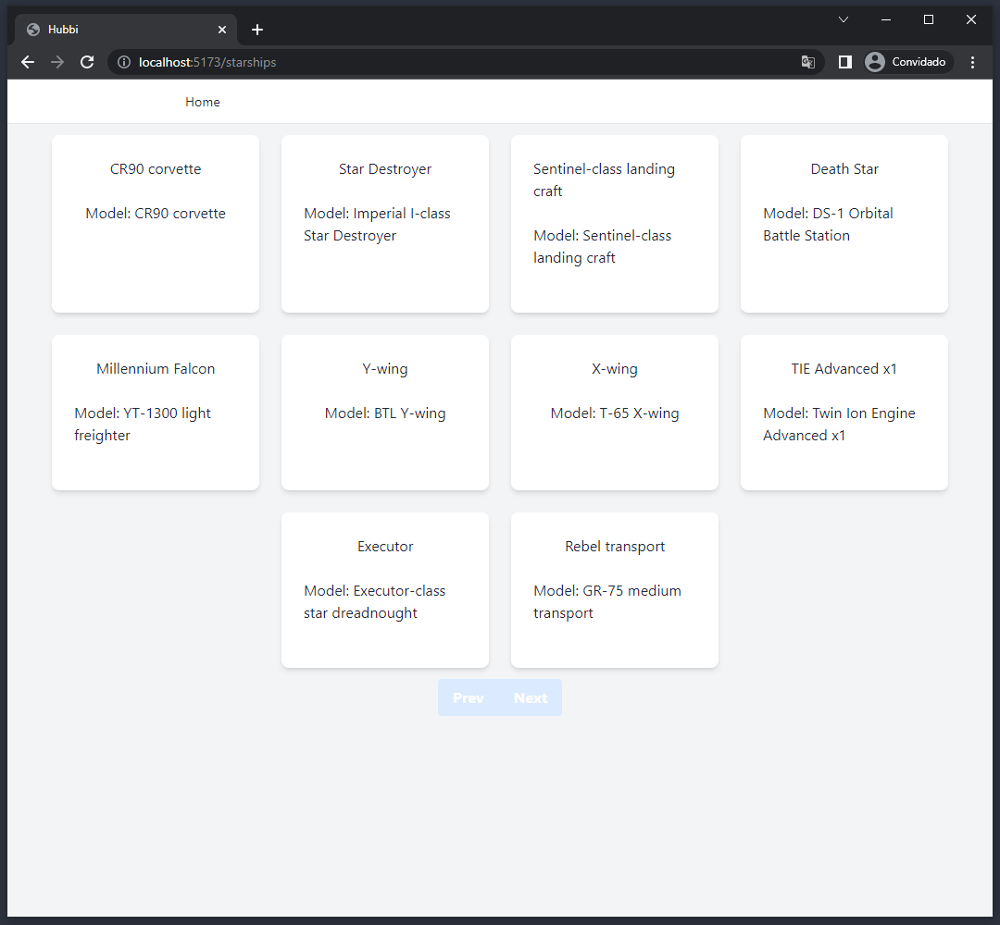
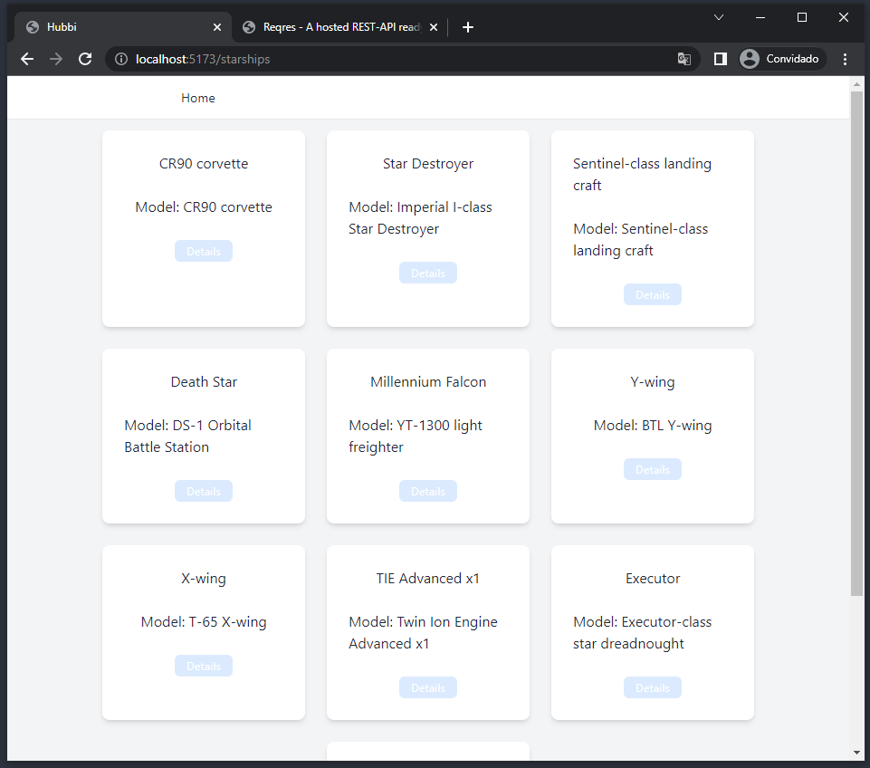
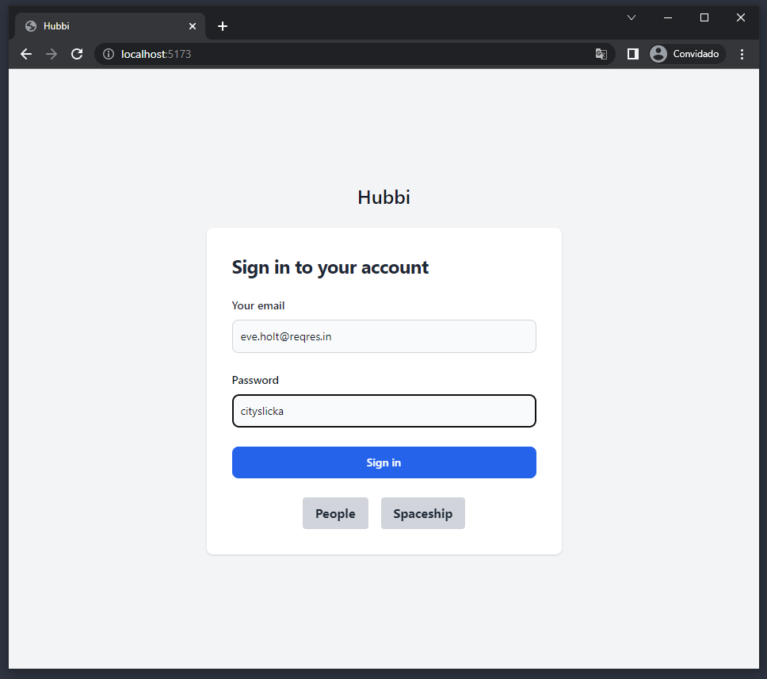

# Boas vindas ao repositório do desafio Hubbi

Esse projeto foi desenvolvido para uma vaga de frontend na empresa [Hubbi](https://www.hubbi.app)

# Sumário

- [Instruções](#instruções)
- [Stack utilizada](#Stack-utilizadas)
- [Screenshots](#Screenshots)
- [Próximos passos](#Próximos-passos)

## Instrução

Clonando o repositorio

```bash
  git@github.com:Raph2ll/Hubbi.git
```

Instale as dependencias e rode a aplicação
// Entre no localhost
```bash
  npm i && npm run dev
```

Login e senha para acessar todos os detalhes da aplicação 

```bash
{
  "email": "eve.holt@reqres.in",
  "password": "cityslicka"
}
```

## Stack utilizada

**Front-end:** React, React-router-dom, Axios, EsLint

**API:** [Reqres](https://reqres.in), [Swapi](https://swapi.dev/)

## Screenshots
### Home


### Lista de personagens 


### Lista de naves


### Lista de naves com o usuario logado


### Acesso correto 



## Próximos passos

* Docker Compose

* Deploy no **Heroku** + PM2

* Testes

* Implementar mais funções no **Nav**

* Implementação de uma API própria 

* Melhorar a experiência do usuário 

* Token de acesso **JWT**

* Adicionar uma página de **LOGIN/REGISTER**

* Implementar um CRUD

* Fazer a aplicação em TypeScript 
